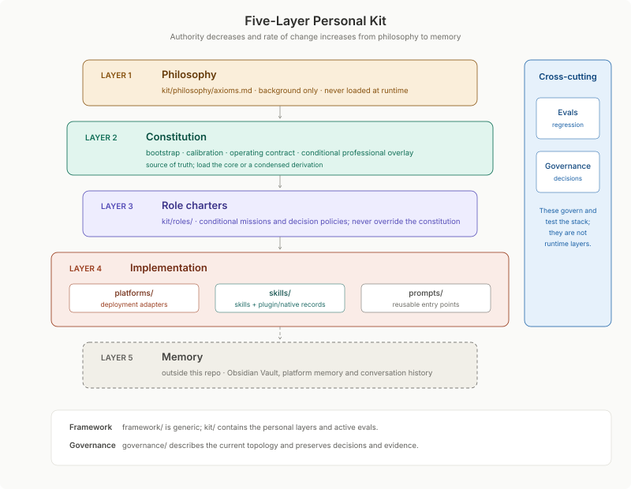

# AI Compact

The constitution and operating terms for every AI that works with me.

AI Compact is a public, versioned collection of plain-markdown instructions, role charters, platform adapters and behavioural tests. It governs how AI thinks with me in conversation and establishes the authority, boundaries and evidence standards for agents that act on my behalf.

The repository contains both a reusable framework and my real personal implementation. The framework can be adopted independently; the kit shows how the pattern works across products and interaction modes.

## Status

The five-layer architecture is established. The [evidence index](governance/evidence/README.md) separates historical behavioural results, source reviews and recorded deployments. The latest [repository consolidation](governance/evidence/2026-09-repository-consolidation.md) preserves the governing decisions while reducing repeated guidance. Product baselines own current deployment gaps; [contract maintenance](kit/implementation/platforms/contract-maintenance.md) owns source coverage and refresh checks.

## How it works

In an exploratory conversation, the operating contract asks the model to widen the frame, challenge material assumptions and leave the conclusion with me. When I own a position and request an output, the `my-voice` skill can render it in my voice. When an agent can use tools or change persistent state, the same constitution supplies its standing boundaries; a role charter adds the judgement policy for that particular job.

## Start here

| If you want to… | Start with |
|---|---|
| Understand the reusable pattern | [Framework](framework/README.md) and its [five-layer model](framework/layer-model.md) |
| Understand this personal implementation | [Personal kit](kit/README.md) |
| Deploy the kit to an AI product | [Platform deployment map](kit/implementation/platforms/deployment-map.md) |
| See how the whole system fits together | [Current architecture](governance/current-architecture.md) |
| Understand why the structure exists | [Architecture decisions](governance/decisions/README.md) |
| Review evaluation and deployment evidence | [Evidence index](governance/evidence/README.md), including the historical behavioural baseline and later source and deployment checks |
| Test a behavioural change | [Evaluation harness](kit/evals/README.md) |
| Maintain this repository | [AGENTS.md](AGENTS.md) and its [CLAUDE.md bridge](CLAUDE.md) |
| Contribute or report a problem | [Contributing](CONTRIBUTING.md) and [security reporting](SECURITY.md) |

## Three repository domains

| Domain | Purpose | Personal content? |
|---|---|---|
| [Framework](framework/README.md) | The generic, reusable specification: layer model, principles and adoption guide. | No. It must remain anonymised and independently publishable. |
| [Kit](kit/README.md) | The personal instance: philosophy, constitution, roles, implementation components and active evals. | Yes. This is the deployable working system. |
| [Governance](governance/README.md) | Current architecture, adopted decisions, diagrams and evaluation evidence. | Where required to explain this implementation and its evolution. |

Repository-maintenance files remain at the root because they govern work across all three domains. Memory remains outside the repository because it is state, not system.

## Five-layer model

The framework and kit use five layers, ordered by authority and inverse rate of change:

| Layer | This implementation | Runtime posture |
|---|---|---|
| 1 — Philosophy | [`kit/philosophy/`](kit/philosophy/README.md) | Background only; never loaded during ordinary work. |
| 2 — Constitution | [`kit/constitution/`](kit/constitution/README.md) | Core files load for full operating context. |
| 3 — Role charters | [`kit/roles/`](kit/roles/README.md) | Load only when a role is active. |
| 4 — Implementation | [`kit/implementation/`](kit/implementation/README.md) | Platform adapters, skills and prompts deploy or execute as needed. |
| 5 — Memory | Outside this repository | The knowledge store, platform memory and conversation history. |

[Evals](kit/evals/README.md) verify behaviour across the personal layers. [Governance](governance/README.md) records why the system is shaped this way. Neither is a sixth runtime layer.

The constitution remains the behavioural source of truth. Shared contract bodies are condensed derivations: they work alone and defer to the full constitution when present. Product addenda require their declared base.

## System boundary

The kit is the portable part of a larger personal AI system. The external knowledge store manages personal knowledge; platform memory supplies ambient continuity; tooling provides reach. The repository governs the seams without absorbing the state itself.

See [Current architecture](governance/current-architecture.md) for the canonical description and [Framework: layer model](framework/layer-model.md) for the generic pattern.

## Deploying the kit

Use the [deployment map](kit/implementation/platforms/deployment-map.md) to choose a product route, then follow its linked guide. It distinguishes standalone contracts, full constitution loading and addenda that require a base, including Cowork. Skills and project context are supplied separately when relevant.

## Maintenance

[AGENTS.md](AGENTS.md) defines repository working rules; [Contributing](CONTRIBUTING.md) defines contribution checks. Maintain the governing source before its derivations, preserve decisions and their rationale, and keep personal content out of the framework. Current architecture, ADRs and concise evidence must make the repository understandable without private working history. Framework changes receive an anonymisation check; high-authority changes follow the critique and evaluation policy.

## Licence

Original content in this repository is licensed under the [Creative Commons Attribution 4.0 International Licence](LICENSE). You may share and adapt it, including commercially, provided you give appropriate credit and indicate changes.

Except for attribution required by the licence, no permission is granted to use Andrew Allen's name, identity or personal information, or to imply endorsement. Third-party material, where identified, remains subject to its own terms.
