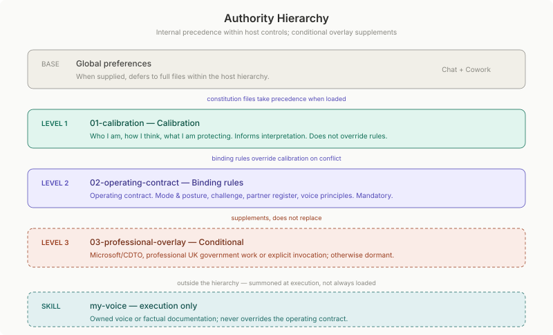
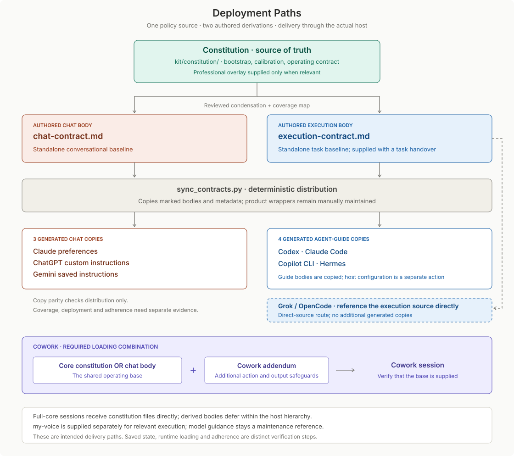
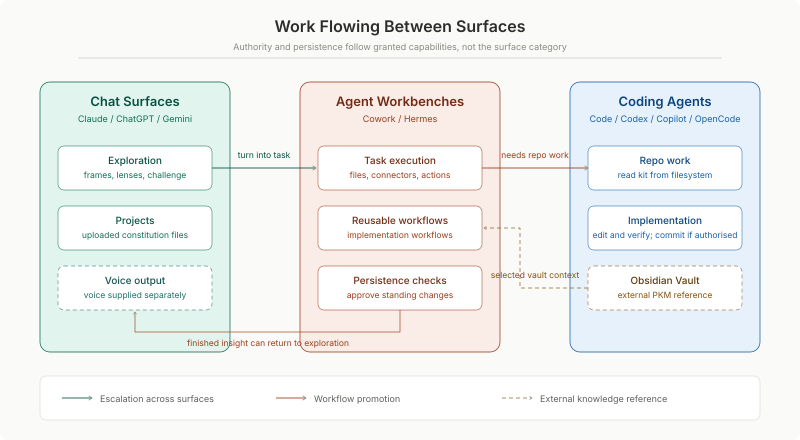

← [Home](../README.md) · [Framework](../framework/README.md) · [Kit](../kit/README.md) · [Governance](README.md) · **Current architecture**

# Current Architecture

The canonical current view of how the generic framework, personal kit, external memory and product surfaces relate. The [framework layer model](../framework/layer-model.md) remains the generic specification; this document describes this implementation.

## Repository domains

| Domain | Responsibility | Boundary |
|---|---|---|
| [Framework](../framework/README.md) | Reusable layer model, design principles and adoption method. | Generic and anonymised; no personal content. |
| [Kit](../kit/README.md) | Personal philosophy, constitution, roles, implementation components and active evals. | The deployable reference implementation. |
| [Governance](README.md) | Current topology, decisions, diagrams and evidence. | Describes and evolves the system; never runtime context. |

Architecture is therefore a view across domains, not a fourth content domain. The generic architecture belongs to the framework; this instantiated topology and its history belong to governance.

## Runtime stack

```text
philosophy         maintenance-time axioms; never ordinary runtime context
    ↓ derives
constitution       source-of-truth calibration and binding operating rules
    ↓ governs
role charters      conditional judgement for distinct roles
    ↓ governs
implementation     platform adapters, skills, plugins/native capabilities and prompts
    ↕ acts across
memory             external knowledge store, platform memory and history
```

Authority flows downward. Evidence from use flows back upward through evals and explicit decisions. A lower layer may adapt a higher layer but cannot override it.



## Deployment topology

The constitution is maintained once in [`kit/constitution/`](../kit/constitution/README.md). Configurable chat products receive condensed standing instructions that work alone and defer to the full constitution. Agent and CLI surfaces receive a minimal derived contract or read the source files directly. Skills and prompts are supplied only when their work is active.



The [deployment map](../kit/implementation/platforms/deployment-map.md) owns product routes. Two shared derivations, [chat](../kit/implementation/platforms/chat-contract.md) and [execution](../kit/implementation/platforms/execution-contract.md), are authored once and distributed to detached copies. [Contract maintenance](../kit/implementation/platforms/contract-maintenance.md) owns coverage and loading combinations, including Cowork's required base plus addendum. These remain layer 4; one model can serve several modes without a different constitution. Internal authority declarations remain subject to host instructions and permissions.

## Capability implementation records

The [skills tracker](../kit/implementation/skills/README.md) records the adopted working set, purpose, upstream sources and brief deployment notes. The [Claude](../kit/implementation/platforms/claude/configuration-baseline.md) and [Codex](../kit/implementation/platforms/codex/configuration-baseline.md) baselines own setup, settings and unresolved deployment work. Dated governance evidence holds detailed observations. Availability, source alignment and successful use remain distinct.

Personal skill source stays in the kit; provider and independent packages stay with their maintainers. The tracker and platform references are maintenance material, not runtime routing instructions. Superseded research registers and the implementation plan are preserved in Git history. The [working-set decision](design-decisions.md#skills-track-the-working-set) records this simplification. Existing capability fixtures remain available for targeted checks.

## Memory boundary

Memory is layer 5 but remains outside the repository because it is changing state rather than portable system definition:

- the personal knowledge store manages curated knowledge;
- platform memory supplies ambient continuity and may be toggled or retained differently by product;
- conversation history belongs to the products that hold it.

The kit governs deliberate actions at this boundary through the constitution and role charters: an agent needs scoped approval before using a tool to change a persistent artefact, including hidden supporting records. A specified change request or instruction to implement a defined plan supplies that approval within its scope; narrower safeguards still apply. Ambient memory and history retained or inferred automatically by a service are product state. Their enablement, retention and review belong in platform settings and deployment guidance; the constitution does not claim to control them. The kit does not prescribe or duplicate the knowledge store's schema.

## Change and evidence flow



- High-authority changes receive a cold critique and behavioural evaluation.
- Constitution changes trigger a derived-platform cascade check.
- Structural changes receive an ADR.
- A material evaluation may produce a concise dated record in [evidence](evidence/README.md).
- Raw working material remains outside maintained governance.

The [architecture decisions](decisions/README.md) explain structural choices. The [evidence index](evidence/README.md) separates historical behavioural results, source reviews and saved-state verification. A dated record supports only its tested configuration; later source changes do not inherit its results or any exception granted for that earlier batch.
